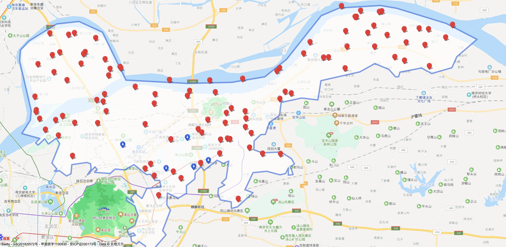

## 论文实验方案
### 数据集信息
用户数据集、快递点数据集（以菜鸟驿站为例）
#### 用户数据集字段信息
用户名 | 经度 |  纬度  | 包裹重量  | 包裹长  | 包裹宽  | 包裹高

#### 快递点数据集字段信息
快递点编号 | 经度 |  纬度  

#### 数据集效果图

#### 论文算法
- package com.algorithm.CoGameBasedCoalitionOrderAlgorithmDesign 基于联盟顺序的合作寄件博弈算法

- package com.algorithm.CoGameBasedSelifishOrderAlgorithmDesign 基于自私顺序的合作寄件博弈算法

#### 算法对比实验(baseline)
- package com.algorithm.NearNotCoAlgorithmDesign 就近非合作寄件分配算法
主要思想：就近选择快递点，然后根据自己包裹的重量计算成本函数
- package com.algorithm.NearAlgorithmDesign 最低移动成本合作寄件分配算法
主要思想：就近选择快递点，然后根据自己包裹的重量计算成本
- package com.algorithm.LowestChargeAlgorithmDesign 最低支付成本算法
主要思想：按照最低成本贪心选择
