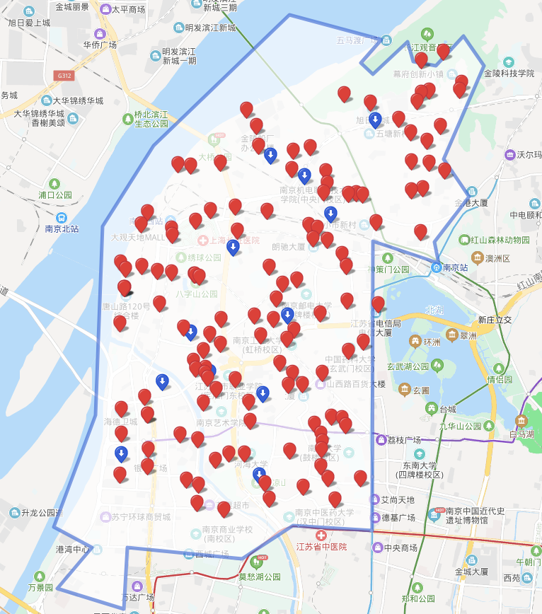

## 论文实验方案
### 数据集信息
用户数据集、快递点数据集（以菜鸟驿站为例）
#### 用户数据集字段信息
用户名 | 经度 |  纬度  | 包裹重量  | 包裹长  | 包裹宽  | 包裹高

#### 快递点数据集字段信息
快递点编号 | 经度 |  纬度  

#### 数据集效果图

#### 论文算法
- package com.large.CoGameBasedCoalitionOrderAlgorithmDesign 基于联盟顺序的合作寄件博弈算法

- package com.large.CoGameBasedSelifishOrderAlgorithmDesign 基于自私顺序的合作寄件博弈算法

- package com.large.CoAlgorithmDesign 合作寄件算法设计(近似算法,近似比 O(1+lnN)) 
     step 1. [Ellipsoid method](https://en.wikipedia.org/wiki/Ellipsoid_method) 椭球法 寻找可行解，该解是连续型最优解
     主要思想：在数学优化中，椭球法是使凸函数最小化的迭代方法。当专门解决有理数据的可行线性优化问题时，椭球法是一种可以在有限步数内找到最优解的算法。 椭球方法生成一系列椭球，其体积在每个步骤中均匀减小，因此包含了凸函数的极小值。
     step 2. 在可行解的基础上实现近似最优解，该解是整型的（0/1）
  

#### 算法对比实验(baseline)
- package com.large.NearNotCoAlgorithmDesign 就近非合作寄件分配算法
  主要思想：就近选择快递点，然后根据自己包裹的重量计算成本函数
- package com.large.NearAlgorithmDesign 最低移动成本合作寄件分配算法
  主要思想：就近选择快递点，然后根据自己包裹的重量计算成本
- package com.large.LowestChargeAlgorithmDesign 最低支付成本算法
  主要思想：按照最低成本贪心选择
- package com.large.MathOptimizationAlgorithmDesign 数学优化
  主要思想：枚举各种情况
